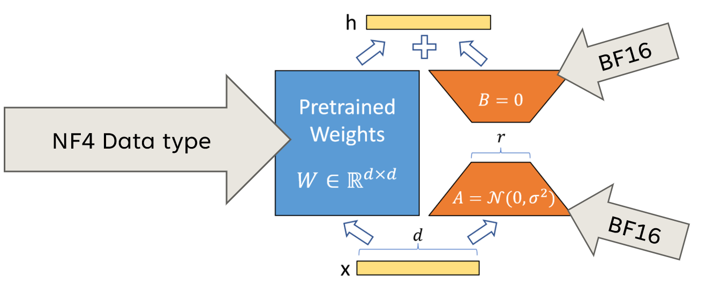

QLoRA (Quantized Low-Rank Adaptation) is an advanced technique designed to optimize neural networks, particularly large language models (LLMs), by combining two key methodologies: quantization and low-rank adaptation (LoRA). Here are the technical details of QLoRA:

## Overview
**Purpose:** QLoRA aims to reduce the computational and memory requirements of large models while maintaining their performance. This is particularly useful for deploying models on resource-constrained devices like smartphones and IoT systems.

## Key Components
### Low-Rank Adaptation (LoRA)
LoRA injects low-rank matrices into the layers of a pre-trained model, allowing for efficient fine-tuning with fewer parameters. This method reduces training time and memory usage while adapting large models to specific tasks without retraining from scratch.

LoRA achieves this by freezing the original model weights and only training the low-rank matrices, which represent updates to the model's parameters.

**Formula:**
$$ W' = W + \Delta W $$
where $ W' $ is the adapted weight matrix, $ W $ is the original weight matrix, and $ \Delta W $ is the low-rank update.

### Quantization
Quantization reduces the precision of model weights and activations, typically converting them from 32-bit floating-point representations to lower precision formats (e.g., 4-bit or 8-bit integers). This step significantly decreases the model's memory footprint and speeds up inference times.

In QLoRA, quantization is applied after low-rank adaptation, allowing for efficient storage and computation while preserving accuracy.

**Formula:**
$ Q(W') = \text{quantize}(W') $
where $ Q(W') $ is the quantized weight matrix.

## Implementation Process
### Step 1: Low-Rank Adaptation
Apply LoRA techniques to the weight matrices of the neural network. This involves creating low-rank matrices that capture essential information while reducing dimensionality.

### Step 2: Quantization
After applying LoRA, quantize the adapted weights and activations. This process involves dividing weight values into smaller intervals and assigning representative values to minimize information loss.

## Advantages
- **Efficiency:** QLoRA enhances efficiency in both storage and computation, making it suitable for deployment on edge devices.
- **Adaptability:** By retaining the adaptability benefits of LoRA, QLoRA allows models to be fine-tuned for specific tasks with minimal computational overhead.
- **Preserved Accuracy:** The combined approach aims to maintain high accuracy despite reduced precision in weights and activations.

## Disadvantages
- **Complexity:** The integration of quantization and low-rank adaptation can introduce complexities in implementation and tuning, requiring careful management of both processes.